#  Verify RedhatEnterprise V.8.8 Compatibility Mongo 4.2.15

## Labs on Aws EC2

สำหรับการ Test ใช้งาน Mongo 4.2.15 บน RHEL 8.8 octa

Step การ Test

- [Verify RedhatEnterprise V.8.8 Compatibility Mongo 4.2.15](#verify-redhatenterprise-v88-compatibility-mongo-4215)
  - [Labs on Aws EC2](#labs-on-aws-ec2)
    - [Setup redhat (This Lab on aws)](#setup-redhat-this-lab-on-aws)
    - [create](#create)
    - [connect](#connect)
    - [check](#check)
  - [update RHEL repo โดย ไม่ update kernel](#update-rhel-repo-โดย-ไม่-update-kernel)
    - [Download](#download)
    - [Check and install](#check-and-install)
      - [Create user admin](#create-user-admin)
      - [Create user สำหรับ test](#create-user-สำหรับ-test)
  - [Testing](#testing)
      - [Local login](#local-login)
      - [Access Public](#access-public)
          - [Security group setting](#security-group-setting)
        - [Mongod config](#mongod-config)
        - [Setting up mongoshell](#setting-up-mongoshell)
      - [Running Test](#running-test)
        - [Test Connections String ใน command line](#test-connections-string-ใน-command-line)
        - [Testing Connection ด้วย Typescript และ Jest testing](#testing-connection-ด้วย-typescript-และ-jest-testing)


<details>
<summary> setup redhat (This Lab on aws)</summary>

### Setup redhat (This Lab on aws)
เราจะสร้าง instant ec2 สำหรับ test การใช้งาน mongo บน ec2 กันโดยจะใช้ image ของ 3rd Party **เนื่องจาก aws official image ไม่มี redhat 8.8 ให้** 
### create
AWS EC2 Console > Launch instant
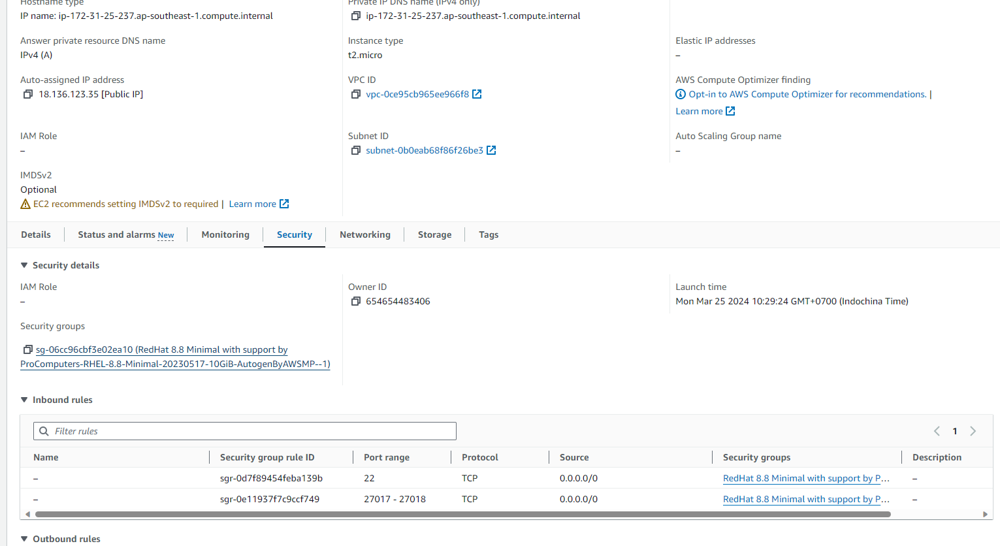

ที่ Applications and OS Image เราจะใช้ AMI Marketplace ซึ่งจะรวม image ของ 3rd party ไว้ กดไปที่ Browse more AMIs

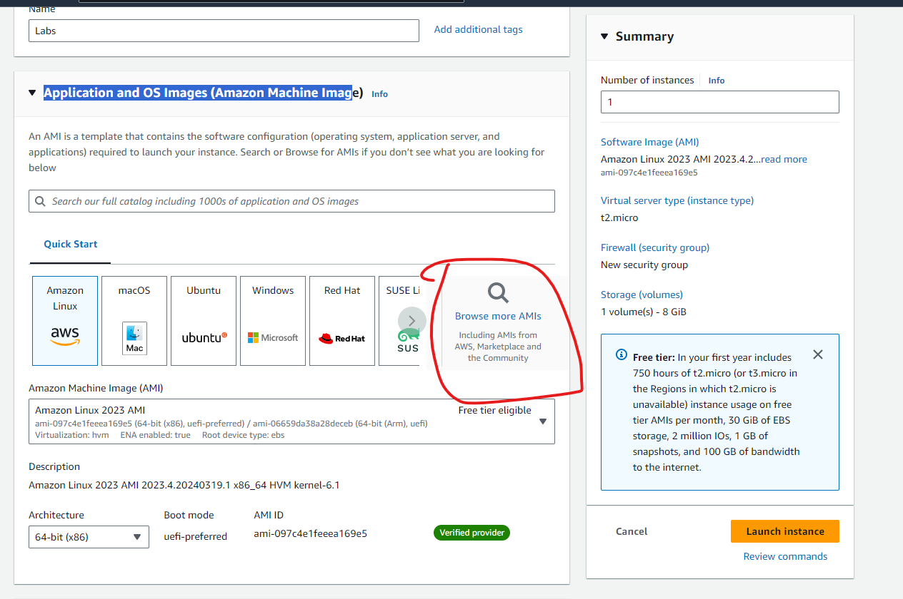

Search หา RHEL 8.8 แล้วเลือก AWS Marketplace AMIs ที่จะมี image ของ 3rd Party แล้วหา RHEL 8.8 ของ Procom

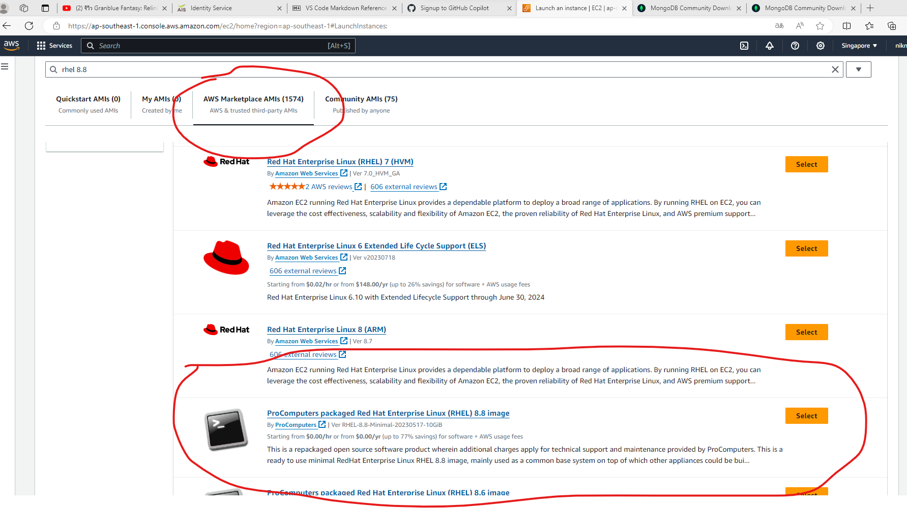

จะขึ้นหน้าชี้แจ้งค่าใช้จ่าย (เสียแค่ของ zone Us)

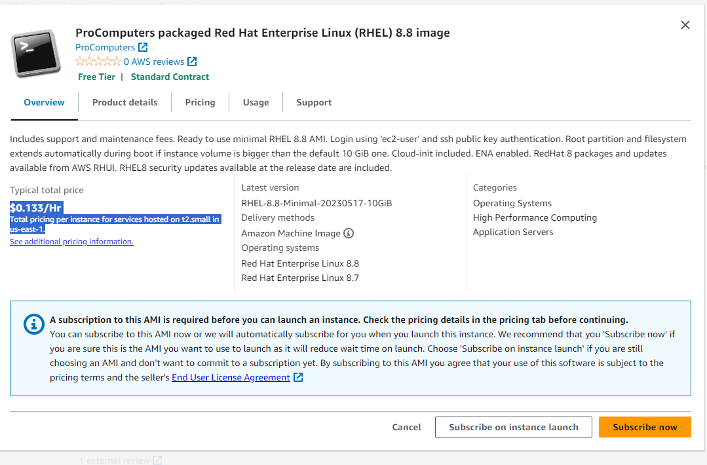

หลังจากได้ image แล้ว setting instant ให้เรียบร้อย
แล้ว Launce Instant ได้เลย

<div style="padding: 10px; color: white; background-color: red;">
<b>อย่าลืม:</b> โปรดสร้าง Security group ที่ inbound ให้ bypass port 27017-27018 เพื่อให้ทดลอง access ได้ และสร้าง key สำหรับ authen และโปรด Download เก็บไว้
</div>

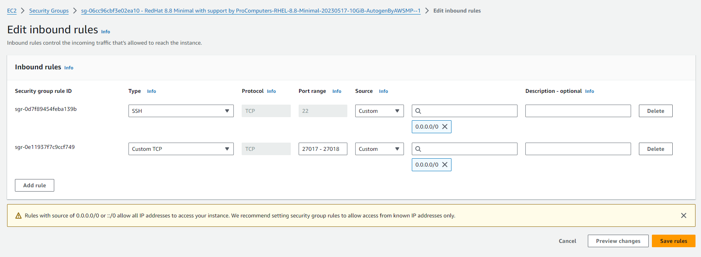
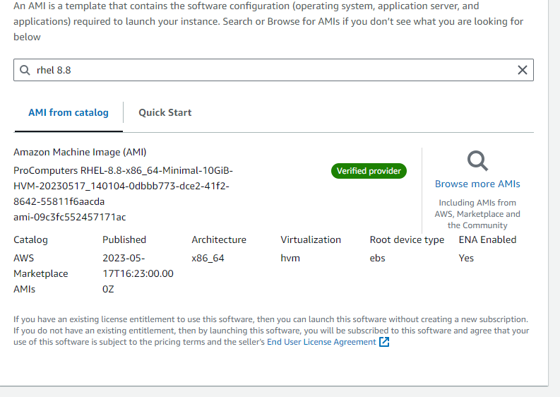

### connect
Connect your instant จะเข้าหน้า console สำหรับ connect จะมี public ip และ default user ให้ส่วน password จะถูกสร้างตอน create instant ไปไฟล์ pem
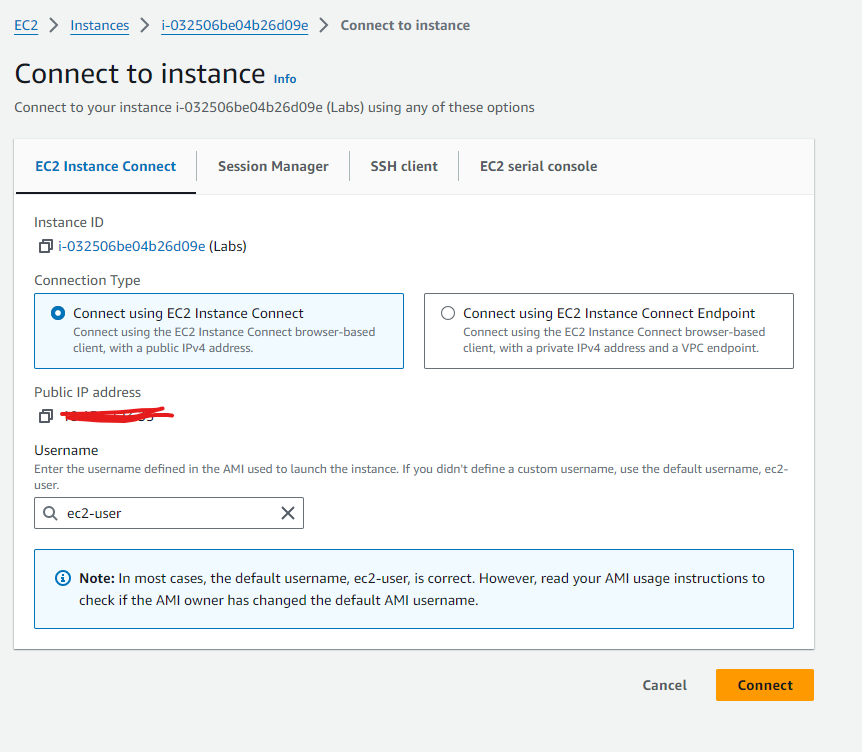

### check
ลอง check release kernel ดูว่าเป็น RHEL versions อะไร

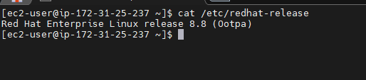
</details>
<details>
<summary>update rhel </summary>

## update RHEL repo โดย ไม่ update kernel
ก่อนจะเริ่มติดตั้งเราต้องการให้ redhat check/update repository ของตัวเองก่อนแต่เราไม่ต้องการให้ update kernel ของ OS เนื่องจากเราต้องการ test ที่ versions 8.8 โดยใช้คำสั่ง

```sudo yum update --exclude=kernel --exclude='redhat-*' --exclude='rhel-*' -y ```

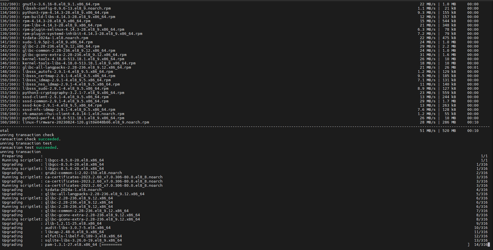

kernel จะไม่ถูก update

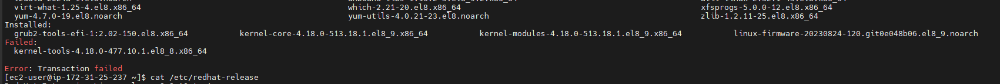
</details>

<details>
<summary> install mongo 4.2.15 </summary> 
ไปที่ Download Center ของ MongoDB จะมี mongo แต่ละ versions ให้ใช้ตาม OS ที่เราต้องการ โดยไปที่ mongo 4.2.15 ของ RHEL 8

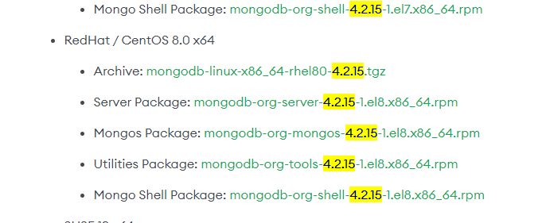
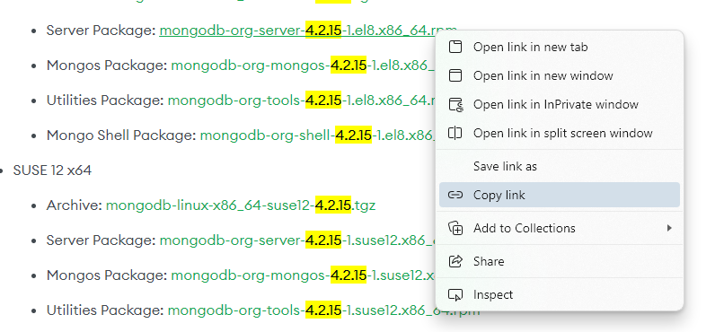

### Download 
ติดตั้ง wget และสร้าง Directory  เพื่อเก็บไฟล์ Download ไฟล์ rpm สำหรับติดตั้ง
Mongo Server

```bash
sudo yum install wget

mkdir mongo
cd mongo/

## Mongo Server
wget https://repo.mongodb.org/yum/redhat/8/mongodb-org/4.2/x86_64/RPMS/mongodb-org-server-4.2.15-1.el8.x86_64.rpm

## Mongos
wget https://repo.mongodb.org/yum/redhat/8/mongodb-org/4.2/x86_64/RPMS/mongodb-org-mongos-4.2.15-1.el8.x86_64.rpm

## Mongo Utility tools
wget https://repo.mongodb.org/yum/redhat/8/mongodb-org/4.2/x86_64/RPMS/mongodb-org-tools-4.2.15-1.el8.x86_64.rpm

## Mongo shell
wget https://repo.mongodb.org/yum/redhat/8/mongodb-org/4.2/x86_64/RPMS/mongodb-org-shell-4.2.15-1.el8.x86_64.rpm

ls -la

```
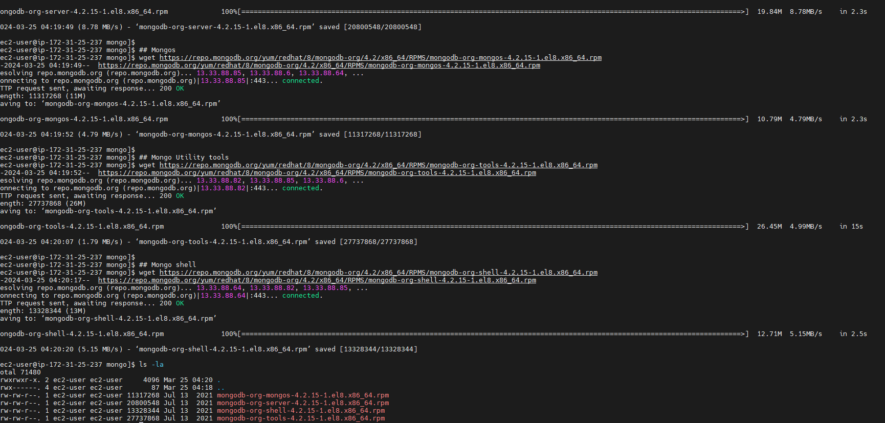
### Check and install
```bash
## setup
sudo rpm -i mongodb-org-*

## Check and Start
sudo service mongod status
sudo service mongod start
sudo service mongod status
```
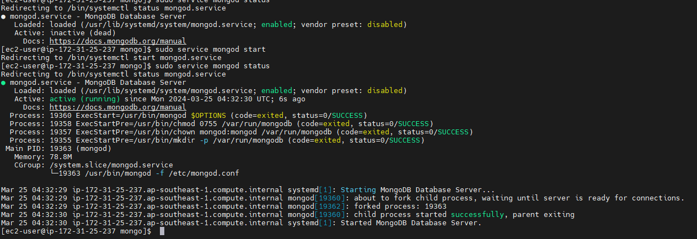
```shell
mongo
db.version()
```
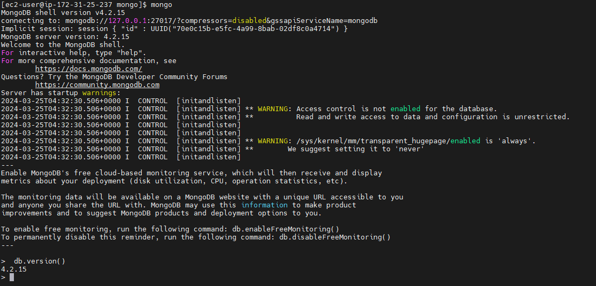
</details>


<details>
<summary> Config MongoDB  </summary>

#### Create user admin

```shell
use admin

db.createUser({user:'<user>', pwd: '<password>', roles:['userAdminAnyDatabase']})

db.auth('user', 'password')
```

#### Create user สำหรับ test
```shell
use admin

db.createUser({ user: "myTestDBUser", pwd: "myTestDBPassword", roles: [{ role: "readWrite", db: "mytestdb" }] });

# exit เพื่อ test login
exit
```
</details>

<details>
<summary> Use Test  </summary>
## Testing 
#### Local login
```shell
 mongo -u myTestDBUser -p myTestDBPassword --authenticationDatabase admin
```

#### Access Public
การจะให้ mongoDB access จาก public หรือจากที่ไหนก็ตาม จำเป็นต้อง config ใน security group ของ ec2 instant และ mongod config

###### Security group setting
ไปที่ console ของ Ec2 กดเข้าไปใน instant ที่ต้องการ  >  security > security groups
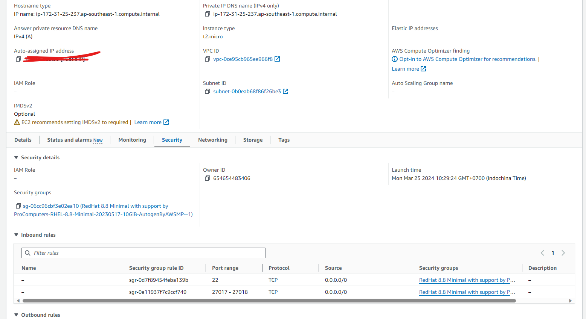
ไปที่ inbound > edit inbound
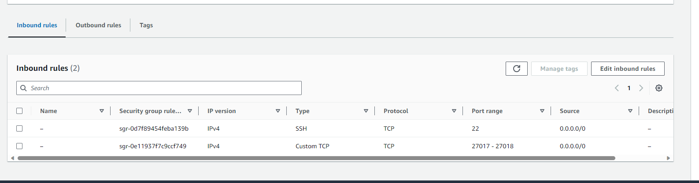
```shell
Add rule

type : customeIP

Port range: 27017-27018 # เลข port ที่เราต้องการ access 

Source: 0.0.0.0/0 # ใครที่สามารถ access ได้ 0/0 คือ anywhere 

save rule
```
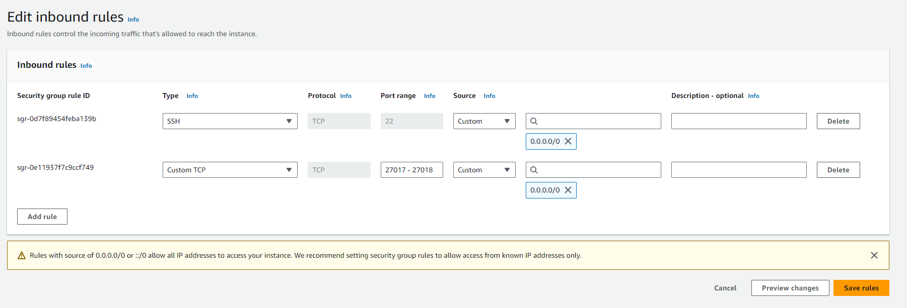
 
 ##### Mongod config
กลับมาที่ terminal ของ Redhat เราจะ config mongod เพื่อให้สามารถ authen จาก public ได้ 
```shell
# default locations config
sudo vi /etc/mongod.conf
```
```shell
# แก้ไข config ตามนี้
net:
  port: 27017 #mongodb port
  bindIp: 0.0.0.0  #access anywhere
security: #uncomment
    authorization: enabled #enable authentications
```
```shell
:wq
```
restart service mongod และ เช็ค status
```shell
sudo service mongod restart
sudo service mongod status
```
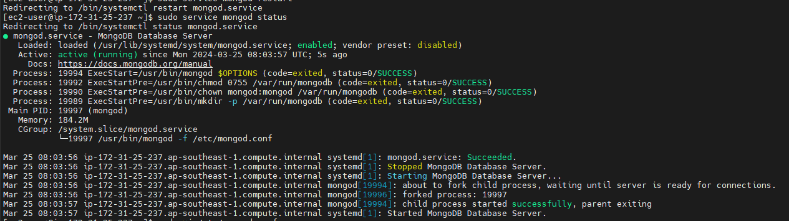
##### Setting up mongoshell
ติดตั้ง mongosh หรือ mongoshell บนเครื่องที่ต้องการทดสอบการ access

ตัวอย่าง test จาก google cloud shell ด้วย mongosh

```shell
# import public key
wget -qO- https://www.mongodb.org/static/pgp/server-7.0.asc | sudo tee /etc/apt/trusted.gpg.d/server-7.0.asc

# add repository ของ mongo
echo "deb [ arch=amd64,arm64 ] https://repo.mongodb.org/apt/ubuntu jammy/mongodb-org/7.0 multiverse" | sudo tee /etc/apt/sources.list.d/mongodb-org-7.0.list

#update
sudo apt-get update

# install mongosh 
sudo apt-get install -y mongodb-mongosh

mongosh -v
```
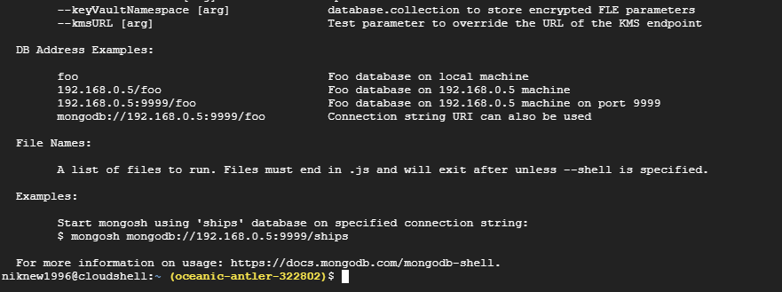

#### Running Test

##### Test Connections String ใน command line
หลังจากติดตั้ง Mongosh ใน เครื่องที่ต้องการใช้งาน mongoDB แล้วให้ลอง Run คำสั่งด้านล่างเพื่อทดสอบการใช้งานผ่าน command line

```bash
#remote
mongosh mongodb://myTestDBUser:myTestDBPassword@<ip>:27017/mytestdb?authSource=admin

# test query

# Find all documents in a collection:
# Find documents with specific criteria:
db.collection.find()
db.collection.find({ "field": "value" })
#Find a single document with specific criteria:
db.collection.findOne({ "field": "value" })
#Insert a new document into a collection:
db.collection.insertOne({ "field": "value" })
#Update a document:
db.collection.updateOne({ "field": "value" }, { $set: { "field2": "value2" } })
#Delete a document:
db.collection.deleteOne({ "field": "value" })
```
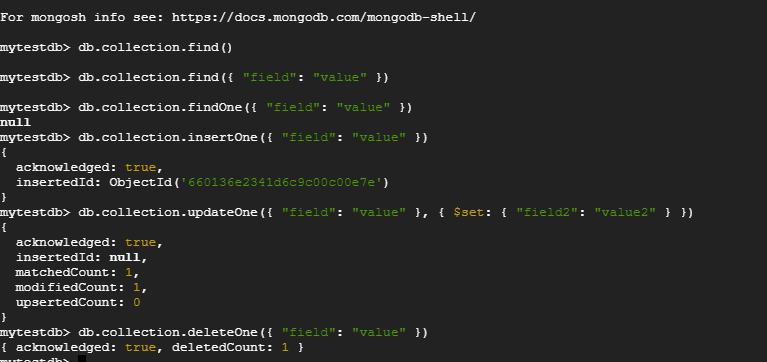

จาก script จะเป็นการทดลอง  search,create,update,delete  collections ด้วยคำสั่ง Query จะได้ผลดังรูป
</details>

##### Testing Connection ด้วย Typescript และ Jest testing
หลังจากลองใน command แล้วเราจะมาลอง Testing Connection ด้วย Typescript และ Jest ใน Repository นี้จะมีไฟล์
[site.test.js](site.test.js) โดย Process จะทดสอบเหมือน Step ที่ทำบน command line
```shell
#Clone Repository ลงในเครื่องต้นทาง

```

<details>
<summary> Create User admin mongo  </summary>

</details>